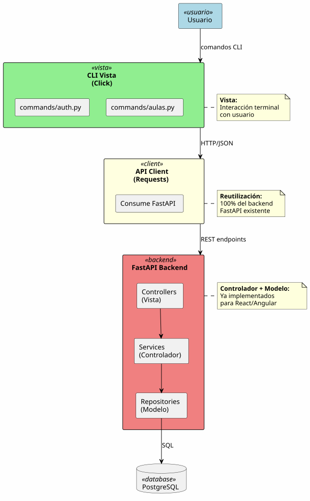
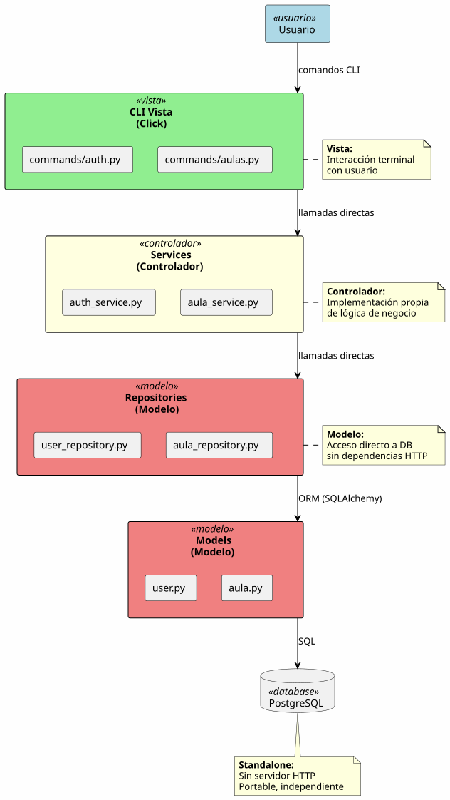

# CLI como validación: independencia de análisis ante decisiones arquitectónicas

<div align=right>

|||||||
|-|-|-|-|-|-|
|[🏠️](../README.md)|**Artículo**|[Contexto](contexto.md)|[Evidencia](evidencia.md)|[Comparativa](comparativa-arquitecturas-cli.md)|[Reutilización](reutilizacion-vs-reimplementacion.md)|

</div>

## Resumen ejecutivo

Este artículo documenta la validación de independencia tecnológica de RUP mediante la implementación de una interfaz CLI (Command Line Interface) para el sistema SigHor. El experimento valida no solo la independencia entre paradigmas de interfaz (GUI vs CLI), sino también la invariancia del análisis RUP ante decisiones arquitectónicas fundamentales (cliente HTTP vs monolítico).

**Resultado experimental:** El mismo análisis MVC soporta dos arquitecturas CLI radicalmente diferentes:

1. CLI como cliente HTTP (consumiendo API FastAPI existente)
2. CLI monolítico (implementación directa sin dependencias web)

Ambas arquitecturas implementan los mismos casos de uso sin modificar el análisis, demostrando que las decisiones arquitectónicas son ortogonales al análisis RUP.

## Del experimento 015 a la pregunta del CLI

### Lo que el artículo 015 validó

El [artículo 015](/extraDocs/015-dashboards-multistack-validacion-experimental/) demostró independencia tecnológica entre dos "primos tecnológicos":

- **FastAPI/React:** Stack minimalista, Python, biblioteca compositiva
- **Spring/Angular:** Stack enterprise, Java, framework *con opinión*

**Similitudes entre ambos stacks:**

- Arquitectura cliente/servidor web
- GUI en navegador
- HTTP/REST para comunicación
- Paradigma de interacción visual

**Pregunta que quedó pendiente:** ¿Qué pasa si eliminamos completamente la GUI?

### CLI como caso extremo de validación

CLI representa el paradigma opuesto a GUI web moderna:

<div align=center>

|GUI Web (React/Angular)|CLI (Terminal)|
|-|-|
|Navegador|Terminal|
|Clicks y formularios|Comandos y prompts|
|Interfaz visual|Interfaz textual|
|HTTP para UI|HTTP opcional|
|Estado en DOM|Estado en archivos/variables|

</div>

**Si el análisis RUP permite este cambio, entonces verdaderamente es independiente de tecnología de presentación.**

## Dimensiones de independencia validadas

### Dimensión 1: Paradigma de interfaz (GUI → CLI)

**Cambio de paradigma:**

- De interfaz gráfica a interfaz textual
- De navegación por clicks a comandos imperativos
- De formularios visuales a prompts secuenciales

**Análisis afectado:** 0%

### Dimensión 2: Decisión arquitectónica (HTTP vs directo)

El experimento CLI reveló una dimensión adicional de validación:

<div align=center>

|Arquitectura 1<br>CLI como cliente HTTP|Arquitectura 2<br>CLI monolítico|
|-|-|
`CLI → HTTP → FastAPI → PostgreSQL`|`CLI → Services → Repositories → PostgreSQL`
Reutiliza backend existente|Sin dependencias de servidor HTTP
Consume mismos endpoints que React|Implementación directa desde análisis
Máxima reutilización de código|Standalone, portable

</div>

**Análisis afectado en ambas:** 0%

## Mapeo de casos de uso a comandos CLI

### Caso de uso: `iniciarSesion()`

#### Análisis RUP (tecnológicamente neutro)

<div align=center>

|Vista|Controlador|Modelo|
|-|-|-|
`FormularioLogin`|`ControladorAutenticacion`|`Usuario`, `Sesion`
Captura username y password|Valida formato de credenciales|`Usuario`: username, password_hash
Muestra error si credenciales inválidas|Busca usuario en base de datos|`Sesion`: token, timestamp
Muestra confirmación si exitoso|Crea sesión si credenciales válidas

</div>

#### Diseño(s)

<div align=center>

<table>
<tr><th>Diseño React (artículo 015)</th><th>Diseño CLI (este artículo)</th></tr>
<tr><td valign=top>

```typescript
// Vista: LoginForm.tsx
const LoginForm = () => {
  return (
    <form onSubmit={handleSubmit}>
      <input name="username" />
      <input name="password" type="password" />
      <button>Iniciar Sesión</button>
    </form>
  );
};
```

</td><td valign=top>

```bash
$ sighor login
Username: admin
Password: ****
✓ Sesión iniciada exitosamente
```

</td></tr>
</table>

</div>

**Observación clave:** La interacción cambia (formulario visual vs prompts), pero las responsabilidades MVC permanecen idénticas.

### Comparativa completa de casos de uso

<div align=center>

| Caso de uso | React (GUI) | CLI (comandos) | Análisis modificado |
|-|-|-|-|
| `iniciarSesion()` | Formulario con campos | `sighor login` + prompts | 0% |
| `abrirAulas()` | Lista con scroll, búsqueda | `sighor aulas list` | 0% |
| `crearAula()` | Modal con formulario | `sighor aulas create` + prompts | 0% |
| `editarAula()` | Formulario inline editable | `sighor aulas edit <id>` | 0% |
| `eliminarAula()` | Botón + diálogo confirmación | `sighor aulas delete <id> --confirm` | 0% |

</div>

**Conclusión:** El análisis MVC captura responsabilidades, no tecnologías de presentación.

## Arquitectura 1: CLI como cliente HTTP

### Diseño conceptual

<div align=center>

||
|:-:|
|**CLI como cliente HTTP - Reutiliza backend FastAPI existente**|
|[Ver diagrama PlantUML](arquitectura-cli-http.puml)|

</div>

### Ventajas de esta arquitectura

1. **Máxima reutilización:** Backend completo ya implementado
2. **Cero duplicación de lógica:** Services y repositories son los mismos
3. **Consistencia garantizada:** Mismo backend para React y CLI
4. **Rapidez de desarrollo:** Solo diseñar comandos CLI

### Ejemplo de implementación

<details><summary><b>Ver código:</b> CLI consumiendo API FastAPI</summary>

```python
# CLI consumiendo API FastAPI
import click
import requests

API_BASE = "http://localhost:8000/api"

@click.command()
def login():
    """Iniciar sesión en el sistema"""
    username = click.prompt('Username')
    password = click.prompt('Password', hide_input=True)

    response = requests.post(f'{API_BASE}/login',
                            json={'username': username, 'password': password})

    if response.status_code == 200:
        token = response.json()['token']
        # Guardar token para comandos posteriores
        click.echo('✓ Sesión iniciada exitosamente')
    else:
        click.echo('✗ Credenciales inválidas', err=True)

@click.command()
@click.option('--format', type=click.Choice(['table', 'json']), default='table')
def list_classrooms(format):
    """Listar todas las aulas"""
    response = requests.get(f'{API_BASE}/classrooms',
                          headers={'Authorization': f'Bearer {get_token()}'})

    if response.status_code == 200:
        classrooms = response.json()

        if format == 'table':
            # Formateo tabla ASCII
            display_table(classrooms)
        else:
            # Salida JSON
            click.echo(json.dumps(classrooms, indent=2))
```

</details>

### Mapeo MVC en arquitectura cliente HTTP

<div align=center>

| Clase de análisis | CLI cliente HTTP | Backend FastAPI | Modificación |
|-|-|-|-|
| **Vista** | Comandos CLI + formateo | Controllers REST | 0% |
| **Controlador** | - | Services (existente) | 0% |
| **Modelo** | - | Repositories + Models (existente) | 0% |

</div>

**Tiempo estimado de diseño:** ~2 horas (5 comandos)

## Arquitectura 2: CLI monolítico

### Diseño conceptual

<div align=center>

||
|:-:|
|**CLI monolítico standalone - Implementación completa de la pila**|
|[Ver diagrama PlantUML](arquitectura-cli-standalone.puml)|

</div>

### Ventajas de esta arquitectura

1. **Standalone:** No requiere servidor HTTP corriendo
2. **Portabilidad:** Ejecutable único, fácil distribución
3. **Rendimiento:** Acceso directo a base de datos
4. **Simplicidad de despliegue:** Sin dependencias de red

### Ejemplo de implementación

<details><summary><b>Ver código:</b> CLI monolítico con implementación directa</summary>

```python
# CLI monolítico con implementación directa
import click
from sqlalchemy import create_engine
from sqlalchemy.orm import sessionmaker

# Modelo
class User:
    def __init__(self, id, username, password_hash):
        self.id = id
        self.username = username
        self.password_hash = password_hash

    def verify_password(self, password: str) -> bool:
        return bcrypt.checkpw(password.encode(), self.password_hash.encode())

# Modelo Repository
class UserRepository:
    def __init__(self, session):
        self.session = session

    def find_by_username(self, username: str) -> Optional[User]:
        return self.session.query(UserModel).filter_by(username=username).first()

# Controlador Service
class AuthenticationService:
    def __init__(self, user_repo, session_repo):
        self.user_repo = user_repo
        self.session_repo = session_repo

    def authenticate(self, username: str, password: str) -> Optional[Session]:
        # Validar formato
        if not self._validate_credentials(username, password):
            return None

        # Buscar usuario
        user = self.user_repo.find_by_username(username)

        if user and user.verify_password(password):
            # Crear sesión
            return self.session_repo.create(user.id)

        return None

    def _validate_credentials(self, username: str, password: str) -> bool:
        return len(username) > 0 and len(password) >= 8

# Vista CLI
@click.command()
def login():
    """Iniciar sesión en el sistema"""
    username = click.prompt('Username')
    password = click.prompt('Password', hide_input=True)

    # Inyección de dependencias manual
    session = get_db_session()
    user_repo = UserRepository(session)
    session_repo = SessionRepository(session)
    auth_service = AuthenticationService(user_repo, session_repo)

    # Controlador
    session_obj = auth_service.authenticate(username, password)

    if session_obj:
        # Guardar token
        save_token(session_obj.token)
        click.echo('✓ Sesión iniciada exitosamente')
    else:
        click.echo('✗ Credenciales inválidas', err=True)
```

</details>

### Mapeo MVC en arquitectura monolítica

<div align=center>

| Clase de análisis | CLI monolítico | Modificación |
|-|-|-|
| **Vista** | Comandos CLI + formateo | 0% |
| **Controlador** | Services (implementados en CLI) | 0% |
| **Modelo** | Repositories + Models (implementados en CLI) | 0% |

</div>

**Tiempo estimado de diseño:** ~6 horas (5 comandos + services + repositories)

## Comparativa de arquitecturas CLI

### Esfuerzo de implementación

<div align=center>

| Aspecto | Cliente HTTP | Monolítico | Diferencia |
|-|-|-|-|
| **Comandos CLI** | 5 comandos (~40 líneas c/u) | 5 comandos (~40 líneas c/u) | Igual |
| **Services** | Reutiliza FastAPI | Implementar desde cero (~300 líneas) | +300 líneas |
| **Repositories** | Reutiliza FastAPI | Implementar desde cero (~200 líneas) | +200 líneas |
| **Total líneas de código** | ~200 | ~700 | +250% |
| **Tiempo estimado** | ~2h | ~6h | +200% |
| **Análisis RUP modificado** | 0% | 0% | **Igual** |

</div>

### Dependencias y portabilidad

<div align=center>

| Aspecto | Cliente HTTP | Monolítico | Ganador |
|-|-|-|-|
| **Requiere servidor HTTP** | Sí (FastAPI) | No | Monolítico |
| **Requiere base de datos** | Sí (indirecto) | Sí (directo) | Empate |
| **Portabilidad** | Baja (2 componentes) | Alta (1 ejecutable) | Monolítico |
| **Rendimiento** | Medio (overhead HTTP) | Alto (acceso directo) | Monolítico |
| **Facilidad de desarrollo** | Alta (reutilización) | Media (desde cero) | Cliente HTTP |
| **Mantenimiento** | Alto (1 backend) | Medio (2 implementaciones) | Cliente HTTP |

</div>

### Cuándo elegir cada arquitectura

<div align=center>

|CLI como cliente HTTP|CLI monolítico|
|-|-|
|Ya existe API REST implementada y probada|CLI se usa en entorno sin servidor (offline, scripts)
|Prioridad: rapidez de desarrollo|Rendimiento crítico (muchas operaciones)
|CLI se usa en entorno con servidor disponible|Distribución simple (ejecutable único)
|Consistencia con frontend web es crítica|Sin dependencias de red

</div>

## La lección metodológica fundamental

### El análisis MVC es invariante ante decisiones arquitectónicas

**Independientemente de si elegimos:**

- CLI vs GUI
- Cliente HTTP vs Monolítico
- FastAPI vs Spring
- React vs Angular

**El análisis MVC permanece inalterado.**

### Tres niveles de independencia validados

1. **Independencia de paradigma de interfaz** (GUI web → CLI)
2. **Independencia de decisión arquitectónica** (cliente HTTP → monolítico)
3. **Invariancia del análisis MVC** ante ambas decisiones

### Implicaciones para RUP

**Para estudiantes:**
> "El análisis RUP captura responsabilidades de negocio, no decisiones tecnológicas. Las arquitecturas son elecciones de diseño basadas en factores técnicos (rendimiento, portabilidad, mantenimiento), no cambios al análisis."

**Para profesionales:**
> "La inversión en análisis MVC riguroso permite explorar múltiples arquitecturas sin rehacer trabajo conceptual. Cada arquitectura reutiliza el mismo análisis, solo cambia el nivel de reutilización tecnológica."

## Conexión con artículos anteriores

### Artículo 014: Prototipado más allá de GUI

El [artículo 014](/extraDocs/014-prototipado-mas-alla-gui/) argumentó:

> "El prototipado RUP no es solo mockups visuales. Incluye validación de APIs, CLIs y cualquier punto de contacto del sistema."

**Este artículo valida esa afirmación:**

Los wireframes SALT, aunque parecen GUI, son abstracciones de interacción que se materializan como:

- GUI web (React, Angular)
- CLI (comandos y prompts)
- API pura (integración sistema-a-sistema)

### Artículo 015: Validación entre stacks web

El [artículo 015](/extraDocs/015-dashboards-multistack-validacion-experimental/) demostró:

> "FastAPI/React y Spring/Angular implementan el mismo análisis sin modificarlo."

**Este artículo extiende esa validación:**

CLI (paradigma radicalmente diferente) también implementa el mismo análisis, demostrando que la independencia tecnológica trasciende la familia de tecnologías web.

## Próximos pasos

### Expansión de comandos CLI

**Fase siguiente:** Implementar comandos adicionales

- `generarHorario()` - Algoritmo complejo de optimización
- Exportación de resultados (CSV, JSON, PDF)
- Modo interactivo vs modo batch

### Validación con otros paradigmas

**Candidatos adicionales:**

- TUI (Terminal UI con curses/textual)
- API GraphQL pura (sin interfaz)
- Interfaz de voz (Alexa/Google Assistant)

### Integración con desarrollo

**Siguiente hito:** Implementación real de CLI

- Crear rama `diseño-cli-python`
- Implementar arquitectura cliente HTTP primero (rápido)
- Considerar arquitectura monolítica si caso de uso lo justifica

## Conclusión

Este artículo documenta una validación de independencia tecnológica de RUP que trasciende las validaciones previas.

**Lo que se ha demostrado:**

1. El análisis MVC es independiente del paradigma de interfaz (GUI vs CLI)
2. El análisis MVC es invariante ante decisiones arquitectónicas (cliente HTTP vs monolítico)
3. Las diferencias de esfuerzo son de implementación, no de validez del análisis
4. RUP permite explorar múltiples arquitecturas con la misma base conceptual

**Lo que esto significa:**

- Las metodologías formales proporcionan valor real cuando se aplican con rigor
- El análisis RUP captura esencia del negocio, no accidentes tecnológicos
- Las decisiones arquitectónicas son optimizaciones técnicas ortogonales al análisis
- La disciplina metodológica paga dividendos en flexibilidad arquitectónica

**El siguiente capítulo:**

Con las validaciones de los artículos 015 y 016, el proyecto pySigHor ha demostrado empíricamente la independencia tecnológica de RUP a través de:

- Dos stacks web (FastAPI/React vs Spring/Angular)
- Paradigma CLI (GUI vs textual)
- Dos arquitecturas CLI (cliente HTTP vs monolítico)

El próximo paso natural es la implementación real en una de estas tecnologías, manteniendo la opción abierta de agregar más en el futuro gracias a la base sólida del análisis RUP.

## Referencias

- [Artículo 003: Análisis independiente de tecnología](/extraDocs/003-rup-independencia-tecnologica/)
- [Artículo 004: Dashboard visual RUP](/extraDocs/004-dashboard-visual-rup-casos-uso/)
- [Artículo 014: Prototipado más allá de GUI](/extraDocs/014-prototipado-mas-alla-gui/)
- [Artículo 015: Dashboards multi-stack](/extraDocs/015-dashboards-multistack-validacion-experimental/)
- [Análisis de casos de uso](https://github.com/mmasias/pySigHor/tree/main/RUP/01-analisis/casos-uso)
