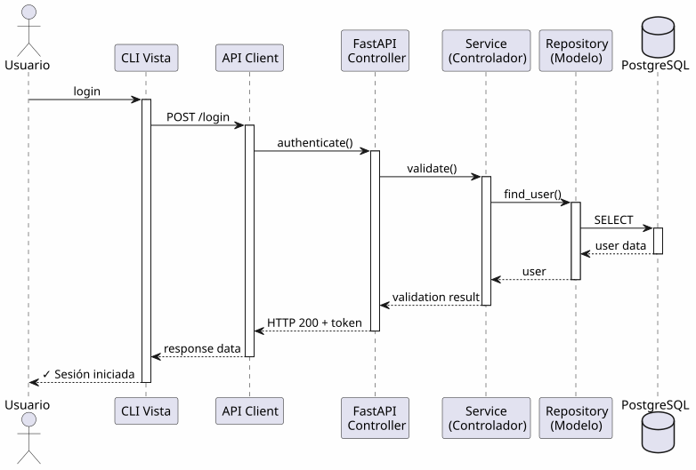
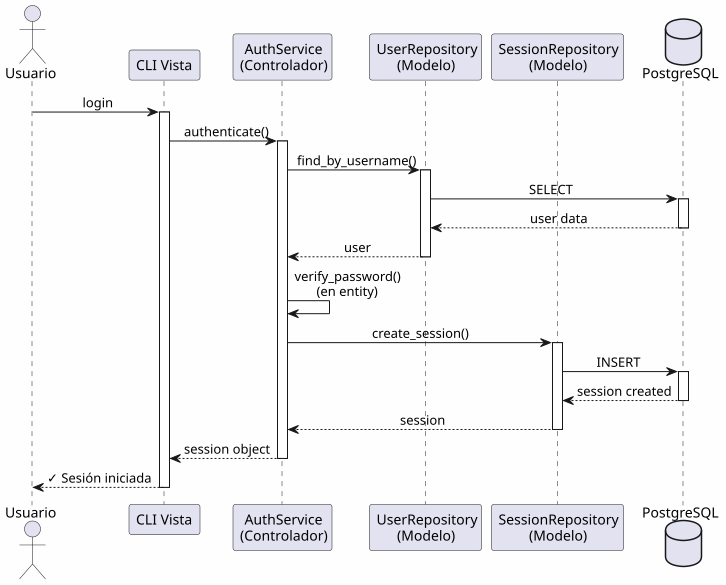

# Evidencia: CLI como validación

<div align=right>

|||||||
|-|-|-|-|-|-|
|[🏠️](../README.md)|[Artículo](README.md)|[Contexto](contexto.md)|**Evidencia**|[Comparativa](comparativa-arquitecturas-cli.md)|[Reutilización](reutilizacion-vs-reimplementacion.md)|

</div>

## Estado antes del experimento CLI

### Dashboard Main: Base tecnológicamente neutra

<div align=center>

||
|:-:|
|**Dashboard Main - 32 casos de uso analizados**|
|[Ver dashboard completo](https://raw.githubusercontent.com/mmasias/pySigHor/main/images/RUP/99-seguimiento/diagrama-contexto-administrador.svg)|
|[Código fuente PlantUML](https://github.com/mmasias/pySigHor/blob/main/RUP/99-seguimiento/diagrama-contexto-administrador.puml)|

</div>

**Estado visual:**

- Todos los casos de uso en 🟫 **Amarillo oscuro** (Analizado)
- Enlaces `[nombreCasoUso()]` → Especificación detallada en `/main/`
- Enlaces `[A]` → Análisis MVC en `/main/`
- Sin enlaces `[D]` - Diseño disponible en ramas específicas

### Diseños web existentes disponibles

|Rama `diseño-fastapi-react`|Rama `diseño-spring-angular`|
|:-:|:-:|
|
|[Ver dashboard completo](https://raw.githubusercontent.com/mmasias/pySigHor/diseño-fastapi-react/images/RUP/99-seguimiento/diagrama-contexto-administrador.svg)|[Ver dashboard completo](https://raw.githubusercontent.com/mmasias/pySigHor/diseño-spring-angular/images/RUP/99-seguimiento/diagrama-contexto-administrador.svg)|

**Casos de uso diseñados en ambos stacks web:**

1. `iniciarSesion()` - Autenticación de usuarios
2. `abrirAulas()` - Apertura de gestión de aulas
3. `crearAula()` - Creación de aulas
4. `editarAula()` - Edición de aulas
5. `eliminarAula()` - Eliminación segura con confirmación


## Evidencia de la Arquitectura 1: CLI como cliente HTTP

### Estructura esperada del proyecto

<details>
<summary>Estructura de directorios del proyecto CLI HTTP</summary>

```
diseño-cli-python-http/
├── pysighor_cli/
│   ├── __init__.py
│   ├── main.py              # Entry point principal
│   ├── commands/
│   │   ├── __init__.py
│   │   ├── auth.py          # Comandos de autenticación
│   │   └── aulas.py         # Comandos de gestión de aulas
│   ├── api_client/
│   │   ├── __init__.py
│   │   ├── client.py        # Cliente HTTP base
│   │   └── endpoints.py     # Definición de endpoints
│   └── utils/
│       ├── __init__.py
│       ├── config.py        # Configuración (API base URL)
│       └── formatters.py    # Formateo de salida
├── requirements.txt         # Dependencies: click, requests
└── README.md
```

</details>

### Ejemplo de código: `iniciarSesion()` como comando CLI

<details>
<summary>Archivo: <code>pysighor_cli/commands/auth.py</code></summary>

```python
import click
import requests
from pysighor_cli.api_client.client import APIClient
from pysighor_cli.utils.config import save_token

@click.command()
def login():
    """
    Iniciar sesión en el sistema pySigHor.

    Este comando consume el endpoint POST /api/login del backend FastAPI.
    Mapea desde la vista CLI de análisis hacia la vista API existente.
    """
    # Vista CLI: Interacción con usuario
    username = click.prompt('Usuario')
    password = click.prompt('Contraseña', hide_input=True)

    # Llamada a API (Controlador Service ya implementado en FastAPI)
    client = APIClient()

    try:
        response = client.post('/login', json={
            'username': username,
            'password': password
        })

        if response.status_code == 200:
            data = response.json()
            token = data['token']

            # Persistencia de token (Modelo en análisis)
            save_token(token)

            click.echo('✓ Sesión iniciada exitosamente')
            click.echo(f'Bienvenido, {data["user"]["nombre"]}')
        else:
            click.echo('✗ Credenciales inválidas', err=True)

    except requests.exceptions.ConnectionError:
        click.echo('✗ Error: No se puede conectar con el servidor', err=True)
        click.echo('  Asegúrate de que el backend FastAPI esté corriendo en http://localhost:8000')
```

</details>

<details>
<summary>Archivo: <code>pysighor_cli/api_client/client.py</code></summary>

```python
import requests
from pysighor_cli.utils.config import get_api_base_url, get_token

class APIClient:
    """
    Cliente HTTP para consumir API FastAPI.

    En términos de análisis MVC:
    - Este es una vista técnica que traduce comandos CLI a llamadas HTTP
    - Reutiliza completamente el controlador y modelo del backend FastAPI
    """

    def __init__(self):
        self.base_url = get_api_base_url()
        self.session = requests.Session()

    def _get_headers(self):
        """Incluye token de autenticación si existe"""
        token = get_token()
        if token:
            return {'Authorization': f'Bearer {token}'}
        return {}

    def get(self, endpoint, **kwargs):
        """GET request con headers de autenticación"""
        headers = self._get_headers()
        return self.session.get(
            f'{self.base_url}{endpoint}',
            headers=headers,
            **kwargs
        )

    def post(self, endpoint, **kwargs):
        """POST request con headers de autenticación"""
        headers = self._get_headers()
        return self.session.post(
            f'{self.base_url}{endpoint}',
            headers=headers,
            **kwargs
        )
```

</details>

### Ejemplo de código: `abrirAulas()` como comando CLI

<details>
<summary>Archivo: <code>pysighor_cli/commands/aulas.py</code></summary>

```python
import click
from pysighor_cli.api_client.client import APIClient
from pysighor_cli.utils.formatters import format_table

@click.command()
@click.option('--page', default=1, help='Número de página')
@click.option('--limit', default=10, help='Resultados por página')
def list_aulas(page, limit):
    """
    Listar todas las aulas del sistema.

    Este comando consume el endpoint GET /api/aulas del backend FastAPI.
    El análisis MVC se mantiene intacto: vista CLI → API REST → controlador → modelo.
    """
    client = APIClient()

    try:
        response = client.get('/aulas', params={
            'page': page,
            'limit': limit
        })

        if response.status_code == 200:
            data = response.json()
            aulas = data['items']
            total = data['total']

            if not aulas:
                click.echo('No se encontraron aulas.')
                return

            # Formateo de tabla para terminal
            headers = ['ID', 'Código', 'Capacidad', 'Edificio', 'Tipo']
            rows = [
                [a['id'], a['codigo'], a['capacidad'], a['edificio'], a['tipo']]
                for a in aulas
            ]

            click.echo(format_table(headers, rows))
            click.echo(f'\nMostrando {len(aulas)} de {total} aulas (Página {page})')
        else:
            click.echo(f'✗ Error al obtener aulas: {response.status_code}', err=True)

    except Exception as e:
        click.echo(f'✗ Error: {str(e)}', err=True)
```

</details>

### Diagrama de secuencia: CLI → API REST → Database

|Diagrama PlantUML|
|-|
||
|Archivo fuente: [secuencia-cli-http.puml](secuencia-cli-http.puml)|

**Observación clave:**

- El CLI solo implementa una nueva vista (comandos en terminal)
- Reutiliza 100% del controlador (services) y modelo (repositories) del backend FastAPI
- El análisis MVC permanece **sin modificación**
- Solo se agrega un nuevo punto de contacto (CLI) al sistema existente

## Evidencia de la Arquitectura 2: CLI monolítico

### Estructura esperada del proyecto

<details>
<summary>Estructura de directorios del proyecto CLI Standalone</summary>

```
diseño-cli-python-standalone/
├── pysighor_cli/
│   ├── __init__.py
│   ├── main.py              # Entry point principal
│   ├── commands/
│   │   ├── __init__.py
│   │   ├── auth.py          # Comandos de autenticación
│   │   └── aulas.py         # Comandos de gestión de aulas
│   ├── services/            # Control layer (NUEVO - implementación propia)
│   │   ├── __init__.py
│   │   ├── auth_service.py
│   │   └── aula_service.py
│   ├── repositories/        # Entity layer (NUEVO - acceso directo a DB)
│   │   ├── __init__.py
│   │   ├── user_repository.py
│   │   └── aula_repository.py
│   ├── models/              # Entity models (NUEVO - SQLAlchemy ORM)
│   │   ├── __init__.py
│   │   ├── user.py
│   │   └── aula.py
│   └── utils/
│       ├── __init__.py
│       ├── database.py      # Database connection
│       └── formatters.py
├── requirements.txt         # Dependencies: click, sqlalchemy, psycopg2
└── README.md
```

</details>

### Ejemplo de código: `iniciarSesion()` monolítico

<details>
<summary>Archivo: <code>pysighor_cli/commands/auth.py</code></summary>

```python
import click
from pysighor_cli.services.auth_service import AuthenticationService
from pysighor_cli.repositories.user_repository import UserRepository
from pysighor_cli.repositories.session_repository import SessionRepository
from pysighor_cli.utils.database import get_db_session
from pysighor_cli.utils.config import save_token

@click.command()
def login():
    """
    Iniciar sesión en el sistema pySigHor (standalone).

    Este comando implementa directamente el análisis MVC sin intermediarios HTTP:
    - Vista: Este comando CLI
    - Controlador: AuthenticationService
    - Modelo: UserRepository, SessionRepository
    """
    # Vista CLI: Interacción con usuario
    username = click.prompt('Usuario')
    password = click.prompt('Contraseña', hide_input=True)

    # Obtener sesión de base de datos
    db_session = get_db_session()

    # Instanciar services y repositories (Controlador + Modelo del análisis)
    user_repo = UserRepository(db_session)
    session_repo = SessionRepository(db_session)
    auth_service = AuthenticationService(user_repo, session_repo)

    try:
        # Controlador: Validación de credenciales
        session_obj = auth_service.authenticate(username, password)

        if session_obj:
            # Persistencia de token
            save_token(session_obj.token)

            click.echo('✓ Sesión iniciada exitosamente')
            click.echo(f'Bienvenido, {session_obj.user.nombre}')
        else:
            click.echo('✗ Credenciales inválidas', err=True)

    except Exception as e:
        click.echo(f'✗ Error al iniciar sesión: {str(e)}', err=True)
    finally:
        db_session.close()
```

</details>

<details>
<summary>Archivo: <code>pysighor_cli/services/auth_service.py</code></summary>

```python
from typing import Optional
from pysighor_cli.models.session import Session
from pysighor_cli.repositories.user_repository import UserRepository
from pysighor_cli.repositories.session_repository import SessionRepository

class AuthenticationService:
    """
    Controlador Service para autenticación.

    Esta clase implementa directamente el controlador del análisis MVC.
    Es equivalente al AuthenticationService del backend FastAPI,
    pero sin dependencias de HTTP/REST.
    """

    def __init__(self, user_repo: UserRepository, session_repo: SessionRepository):
        self.user_repo = user_repo
        self.session_repo = session_repo

    def authenticate(self, username: str, password: str) -> Optional[Session]:
        """
        Autentica usuario y crea sesión.

        Responsabilidades (del análisis):
        1. Validar formato de credenciales
        2. Buscar usuario en repositorio
        3. Verificar contraseña
        4. Crear sesión si es válido
        """
        # Validación de formato
        if not self._validate_credentials(username, password):
            return None

        # Buscar usuario (delegación a Modelo)
        user = self.user_repo.find_by_username(username)

        if not user:
            return None

        # Verificar contraseña
        if not user.verify_password(password):
            return None

        # Crear sesión (delegación a Modelo)
        session = self.session_repo.create(user.id)

        return session

    def _validate_credentials(self, username: str, password: str) -> bool:
        """Validación de formato de credenciales"""
        return bool(username and password and len(username) >= 3)
```

</details>

<details>
<summary>Archivo: <code>pysighor_cli/repositories/user_repository.py</code></summary>

```python
from typing import Optional
from sqlalchemy.orm import Session
from pysighor_cli.models.user import User

class UserRepository:
    """
    Modelo Repository para usuarios.

    Esta clase implementa el acceso a datos del análisis MVC.
    Encapsula todas las operaciones de persistencia de usuarios.
    """

    def __init__(self, db_session: Session):
        self.db = db_session

    def find_by_username(self, username: str) -> Optional[User]:
        """
        Busca usuario por nombre de usuario.

        Responsabilidad del Modelo: Acceso a datos.
        """
        return self.db.query(User).filter(User.username == username).first()

    def find_by_id(self, user_id: int) -> Optional[User]:
        """Busca usuario por ID"""
        return self.db.query(User).filter(User.id == user_id).first()
```

</details>

<details>
<summary>Archivo: <code>pysighor_cli/models/user.py</code></summary>

```python
from sqlalchemy import Column, Integer, String
from sqlalchemy.ext.declarative import declarative_base
import bcrypt

Base = declarative_base()

class User(Base):
    """
    Modelo Model para usuarios.

    Representa la entidad Usuario del análisis MVC.
    """
    __tablename__ = 'users'

    id = Column(Integer, primary_key=True)
    username = Column(String(50), unique=True, nullable=False)
    password_hash = Column(String(255), nullable=False)
    nombre = Column(String(100))
    email = Column(String(100))

    def verify_password(self, password: str) -> bool:
        """
        Verifica contraseña contra hash almacenado.

        Responsabilidad del Modelo: Lógica de negocio de la entidad.
        """
        return bcrypt.checkpw(
            password.encode('utf-8'),
            self.password_hash.encode('utf-8')
        )
```

</details>

### Diagrama de secuencia: CLI → Services → Repositories → Database

|Diagrama PlantUML|
|-|
||
|Archivo fuente: [secuencia-cli-standalone.puml](secuencia-cli-standalone.puml)|

**Observación clave:**

- El CLI implementa **toda la pila**: vista + controlador + modelo
- **Sin dependencias de HTTP/REST/FastAPI**
- El análisis MVC se mapea **directamente** a código Python standalone
- El análisis permanece **sin modificación** - solo cambia la implementación técnica


## Comparación lado a lado: Arquitectura 1 vs Arquitectura 2

### Caso de uso: `iniciarSesion()`

| Aspecto | Arquitectura 1 (HTTP) | Arquitectura 2 (Monolítico) |
|-|-|-|
| **Vista** | `commands/auth.py` → APIClient | `commands/auth.py` → AuthService |
| **Controlador** | Reutiliza FastAPI backend | Implementa `AuthenticationService` |
| **Modelo** | Reutiliza FastAPI backend | Implementa `UserRepository` + `SessionRepository` |
| **Dependencias** | `click`, `requests` | `click`, `sqlalchemy`, `psycopg2` |
| **Servidor requerido** | Sí (FastAPI corriendo) | No (standalone) |
| **Tiempo estimado** | ~30 min | ~1.5 horas |
| **Artefactos nuevos** | 3 archivos | 7 archivos |
| **Líneas de código** | ~80 LOC | ~250 LOC |
| **Reutilización** | 100% de backend | 0% de backend (reimplementación) |
| **Análisis MVC modificado** | No | No |

### Validación de independencia tecnológica

| Dimensión | Arquitectura 1 | Arquitectura 2 | Análisis afectado |
|-|-|-|-|
| **Paradigma de interfaz** | CLI (terminal) | CLI (terminal) | No |
| **Arquitectura de sistema** | Cliente HTTP | Monolítico standalone | No |
| **Tecnología de persistencia** | API REST | SQLAlchemy ORM | No |
| **Patrón de comunicación** | HTTP/JSON | Llamadas directas | No |
| **Responsabilidades MVC** | Vista → Controlador → Modelo | Vista → Controlador → Modelo | No |

**Conclusión visual:** El análisis MVC permanece **100% inalterado** independientemente de:

1. Paradigma de interfaz (GUI web → CLI terminal)
2. Arquitectura de sistema (cliente HTTP → monolítico)
3. Stack tecnológico (FastAPI/React → Python/Click)


## Métricas del experimento CLI

### Resistencia del análisis

| Métrica | Valor | Interpretación |
|-|-|-|
| **Casos de uso analizados** | 32 | Base completa sin modificación |
| **Casos diseñados CLI (HTTP)** | 5 | Mismo conjunto de casos que web stacks |
| **Casos diseñados CLI (standalone)** | 5 | Mismo conjunto de casos que web stacks |
| **Artefactos de análisis modificados** | 0 | **100% de independencia tecnológica** |
| **Diagramas MVC modificados** | 0 | **100% de validez transversal** |
| **Especificaciones detalladas modificadas** | 0 | **100% de reutilización** |

### Comparativa de esfuerzo

| Caso de Uso | GUI React | GUI Angular | CLI HTTP | CLI Standalone |
|-|-|-|-|-|
| `iniciarSesion()` | 1h | 1h | 0.5h | 1.5h |
| `abrirAulas()` | 1h | 1h | 0.5h | 1.5h |
| `crearAula()` | 1h | 1h | 0.5h | 1.5h |
| `editarAula()` | 1.5h | 1.5h | 0.5h | 2h |
| `eliminarAula()` | 1h | 1h | 0.5h | 1.5h |
| **TOTAL** | **~5.5h** | **~5.5h** | **~2.5h** | **~8h** |

**Observaciones:**

- CLI HTTP es **2.2x más rápido** que GUI web (reutiliza backend completo)
- CLI standalone es **1.5x más lento** que GUI web (reimplementa toda la pila)
- **Todos mantienen el análisis sin cambios** - diferencia solo en implementación


## Evidencia esperada: Dashboards CLI

### Dashboard CLI HTTP (cuando se implemente)

<details>
<summary>Estado esperado en rama <code>diseño-cli-python-http</code></summary>

```
diagrama-contexto-administrador.svg
- 5 casos en verde (diseñados): iniciarSesion, abrirAulas, crearAula, editarAula, eliminarAula
- 27 casos en amarillo oscuro (analizados)
- Enlaces [D] → /diseño-cli-python-http/RUP/02-diseño/

Leyenda:
- CLI Python HTTP (stack actual)
- Cambiar a: FastAPI/React | Spring/Angular | CLI Python Standalone
```

</details>

### Dashboard CLI Standalone (cuando se implemente)

<details>
<summary>Estado esperado en rama <code>diseño-cli-python-standalone</code></summary>

```
diagrama-contexto-administrador.svg
- 5 casos en verde (diseñados): iniciarSesion, abrirAulas, crearAula, editarAula, eliminarAula
- 27 casos en amarillo oscuro (analizados)
- Enlaces [D] → /diseño-cli-python-standalone/RUP/02-diseño/

Leyenda:
- CLI Python Standalone (stack actual)
- Cambiar a: FastAPI/React | Spring/Angular | CLI Python HTTP
```

</details>

### Comparación visual esperada (4 dashboards)

<div align=center>

|FastAPI/React (GUI)|Spring/Angular (GUI)|CLI HTTP|CLI Standalone|
|:-:|:-:|:-:|:-:|
|5 diseñados (verde)|5 diseñados (verde)|5 diseñados (verde)|5 diseñados (verde)|
|27 pendientes|27 pendientes|27 pendientes|27 pendientes|
|GUI web|GUI web|Terminal|Terminal|
|Cliente HTTP|Cliente HTTP|Cliente HTTP|Monolítico|

</div>

**Invariante:** Los 4 dashboards muestran los **mismos 5 casos en verde**, validando que el análisis es **verdaderamente independiente** de:

- Paradigma de interfaz (GUI vs CLI)
- Stack tecnológico (Python vs Java, React vs Angular)
- Arquitectura de sistema (cliente HTTP vs monolítico)

## Próxima evidencia esperada

### Implementación real

**Fase siguiente:** Diseñar e implementar CLI en ambas arquitecturas

**Objetivo:**

1. Crear rama `diseño-cli-python-http`
2. Implementar 5 comandos consumiendo API FastAPI
3. Crear rama `diseño-cli-python-standalone`
4. Implementar 5 comandos con pila completa standalone
5. Generar dashboards actualizados
6. Documentar commits específicos

**Validación final esperada:**

- Dashboards con casos CLI en verde
- Código fuente verificable en GitHub
- Artefactos de análisis sin modificación
- Medición de tiempo real de implementación

## Referencias

- [Dashboard Main](https://raw.githubusercontent.com/mmasias/pySigHor/main/images/RUP/99-seguimiento/diagrama-contexto-administrador.svg)
- [Dashboard FastAPI/React](https://raw.githubusercontent.com/mmasias/pySigHor/diseño-fastapi-react/images/RUP/99-seguimiento/diagrama-contexto-administrador.svg)
- [Dashboard Spring/Angular](https://raw.githubusercontent.com/mmasias/pySigHor/diseño-spring-angular/images/RUP/99-seguimiento/diagrama-contexto-administrador.svg)
- [Artículo 015: Validación multi-stack web](../015-dashboards-multistack-validacion-experimental/)
- [Repositorio pySigHor](https://github.com/mmasias/pySigHor)
